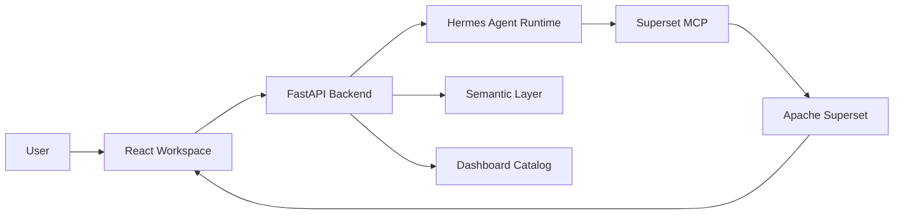

# Hermes BI Studio

Hermes BI Studio is an AI+BI product prototype. Users ask business questions in natural language, Hermes plans or adjusts BI work, Superset creates and renders dashboards, and the product shell provides a unified workspace for realtime agent logs, embedded BI assets, publishing, and analysis.

## What This Project Is For

The goal is to validate an AI-assisted BI workflow:

- Reuse similar dashboards when they already exist.
- Generate new dashboards when no good match exists.
- Show the data plan before creating BI assets.
- Let users adjust dashboards in natural language.
- Publish dashboards as reusable assets.
- Run deeper analysis from dashboard lineage, related dashboards, and uploaded files.

The current codebase is an MVP foundation. It already includes a FastAPI backend, a React workspace, a Superset MCP/Hermes integration path, realtime generation logs, local fallback previews, and local Superset embedding.

## Architecture Overview



Responsibilities:

- `frontend`: product shell, prompt input, realtime logs, embedded Superset dashboard, analysis panel.
- `backend`: API contracts, streaming orchestration, product state, Hermes runtime isolation.
- `Hermes`: reasoning, planning, Superset MCP tool use, report generation.
- `Superset`: BI datasets, charts, dashboards, native filters, dashboard rendering.

See:

- [Product spec](docs/PRODUCT_SPEC.md)
- [Architecture](docs/ARCHITECTURE.md)
- [Parallel workstreams](docs/PARALLEL_WORKSTREAMS.md)
- [ADR-001](docs/decisions/ADR-001-hermes-superset-product-boundary.md)

## Repository Structure

```text
backend/              FastAPI backend
frontend/             React + Vite frontend
infra/                Local infrastructure helpers
tools/                Superset demo registration and utility scripts
docs/                 Product, API, architecture, frontend, and workflow docs
.hermes-runtime/      Product-scoped Hermes runtime config, excluding logs/session state
```

## Prerequisites

- Python 3.11+
- Node.js 20+
- Local Hermes checkout
- Local Superset install
- `uv` / `uvx` available for `mcp-superset`

Current local defaults:

- Frontend: `http://127.0.0.1:5173` or `http://localhost:5173`
- Backend: `http://127.0.0.1:8000`
- Superset: `http://127.0.0.1:8088` / `http://localhost:8088`

## Environment

Copy `.env.example` to `.env` for local backend overrides. The MVP currently also reads your Hermes env file from `C:\Users\Zhang Linruo\.hermes\.env` for model credentials.

More detail: [Development setup](docs/DEVELOPMENT.md).

## Quick Start

Backend:

```powershell
cd E:\dev_apps\ai-bi-mvp\backend
python -m pip install -e .
python -m uvicorn app.main:app --host 127.0.0.1 --port 8000
```

Frontend:

```powershell
cd E:\dev_apps\ai-bi-mvp\frontend
npm install
npm run dev -- --host 127.0.0.1 --port 5173
```

Superset:

```powershell
$env:SUPERSET_CONFIG_PATH='D:\superset\superset_config.py'
$env:PYTHONPATH='E:\dev_apps\ai-bi-mvp\vendor_py'
& 'D:\superset\.venv\Scripts\superset.exe' run -h 127.0.0.1 -p 8088 --with-threads
```

Open:

- Product: [http://localhost:5173](http://localhost:5173)
- API docs: [http://127.0.0.1:8000/docs](http://127.0.0.1:8000/docs)
- Superset: [http://localhost:8088](http://localhost:8088)

## Important Local Superset Note

For local iframe embedding, Superset must allow the product frontend as a frame ancestor. This is a development convenience. Production should use Superset embedded dashboards and guest tokens instead of broad local iframe settings.

## Documentation

- [API documentation](docs/API.md)
- [Development setup](docs/DEVELOPMENT.md)
- [Frontend architecture](docs/FRONTEND.md)
- [Product spec](docs/PRODUCT_SPEC.md)
- [Architecture](docs/ARCHITECTURE.md)
- [Parallel workstreams](docs/PARALLEL_WORKSTREAMS.md)
- [Changelog](CHANGELOG.md)
