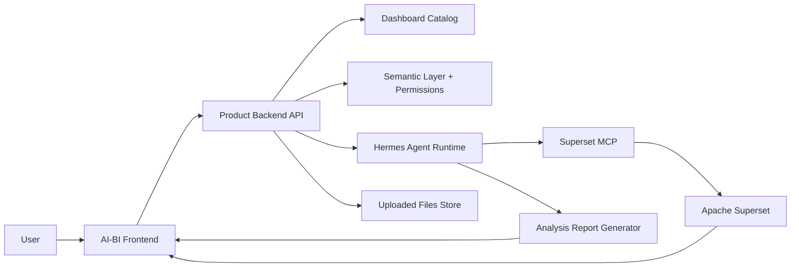
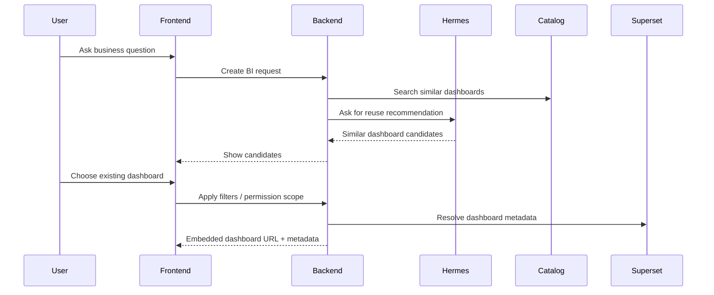
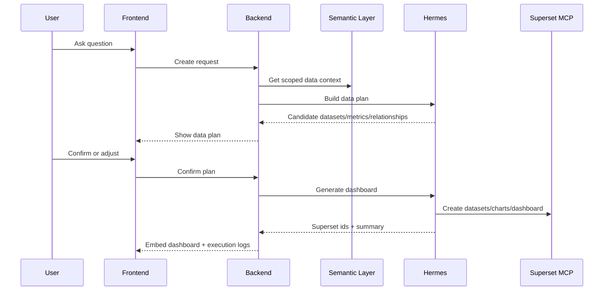
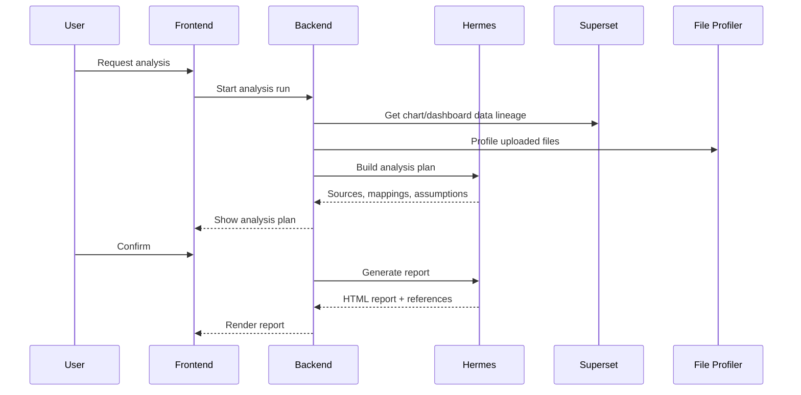

# Architecture

## System Overview

The product is split into five layers:

1. Frontend workspace
2. Product backend
3. Hermes orchestration layer
4. Semantic and governance layer
5. Superset BI engine

## Responsibilities

### Frontend Workspace

- Prompt input
- Realtime agent logs
- Similar-dashboard confirmation
- Data-plan confirmation
- Embedded Superset dashboard
- Publish/share controls
- Natural-language adjustment UI
- Deep-analysis report UI
- File upload UI

### Product Backend

- API contracts
- Streaming orchestration endpoints
- Request/session state
- Dashboard catalog
- User permissions
- Semantic-layer metadata
- Uploaded file profiling
- Hermes runtime isolation
- Result persistence

### Hermes Runtime

- Interprets user intent
- Chooses reuse vs generation path
- Calls Superset MCP tools
- Produces structured plans and results
- Runs analysis skills
- Generates analysis reports

Hermes should not own product state. It proposes and executes operations through explicit tools and returns structured outputs.

### Semantic Layer

The semantic layer describes:

- Business entities
- Datasets
- Metrics
- Dimensions
- Join relationships
- Time fields
- Access policies
- Certified data objects

Hermes receives a scoped semantic context for the current user, not unrestricted database access.

### Superset

Superset owns:

- Database connections
- Datasets
- Charts
- Dashboards
- Native filters
- BI interactions such as drill/filter/explore

The product embeds Superset dashboards and stores product-level metadata separately.

## Core Domain Objects

### BIRequest

Represents one user request.

Fields:

- `id`
- `user_id`
- `prompt`
- `mode`
- `status`
- `created_at`
- `selected_dashboard_id`
- `selected_data_plan_id`

### DashboardCatalogItem

Represents a reusable dashboard.

Fields:

- `id`
- `owner_id`
- `superset_dashboard_id`
- `title`
- `description`
- `semantic_signature`
- `dataset_ids`
- `metric_names`
- `dimension_names`
- `published`
- `visibility`
- `created_at`
- `updated_at`

### DataPlan

The confirmed plan for dashboard generation.

Fields:

- `id`
- `request_id`
- `datasets`
- `metrics`
- `dimensions`
- `relationships`
- `filters`
- `permission_constraints`
- `assumptions`
- `status`

### DashboardDraft

Product-side representation of generated or reused dashboard.

Fields:

- `id`
- `title`
- `status`
- `superset_dashboard_id`
- `chart_ids`
- `data_plan_id`
- `lineage`
- `execution_events`
- `integration_notes`

### AnalysisRun

Represents a deep-analysis job.

Fields:

- `id`
- `dashboard_ids`
- `uploaded_file_ids`
- `analysis_skill`
- `analysis_plan`
- `status`
- `report_html`
- `source_references`

## Main Workflows

### Similar Dashboard Reuse

### New Dashboard Generation

### Deep Analysis

## API Surface To Build

### Dashboard Planning

- `POST /api/bi/requests`
- `GET /api/bi/requests/{id}/similar-dashboards`
- `POST /api/bi/requests/{id}/reuse-dashboard`
- `POST /api/bi/requests/{id}/data-plan`
- `POST /api/bi/data-plans/{id}/confirm`

### Dashboard Generation and Adjustment

- `POST /api/dashboards/generate/stream`
- `POST /api/dashboards/{id}/adjust/stream`
- `POST /api/dashboards/{id}/publish`
- `POST /api/dashboards/{id}/fork`

### Analysis

- `POST /api/uploads`
- `POST /api/analysis-runs`
- `POST /api/analysis-runs/{id}/plan`
- `POST /api/analysis-runs/{id}/run/stream`
- `GET /api/analysis-runs/{id}`

## Runtime Isolation

The product uses `.hermes-runtime/config.yaml` so backend-driven Hermes runs only see product-approved MCP servers. This prevents global Hermes MCP tools, credentials, or user experiments from leaking into product execution.

## Security And Governance

- Never pass unrestricted database catalogs to Hermes.
- Always scope semantic context by user permissions.
- Treat uploaded files as untrusted input.
- Store lineage and assumptions for generated dashboards and reports.
- Do not commit secrets or runtime logs.
- Local iframe embedding is a development convenience; production should use Superset embedded dashboards and guest tokens.
